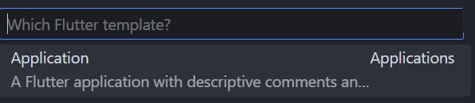
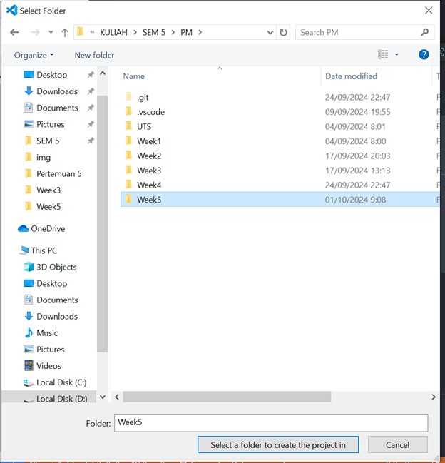
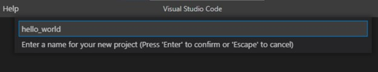
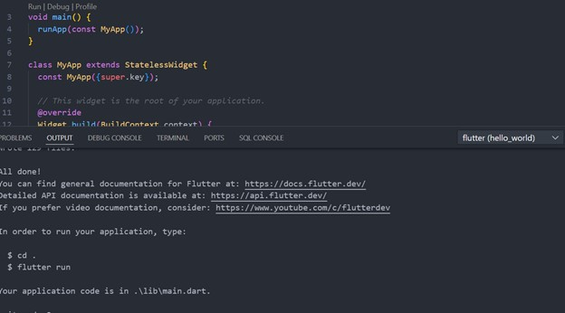
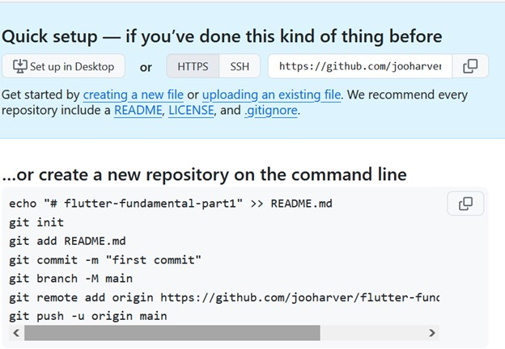
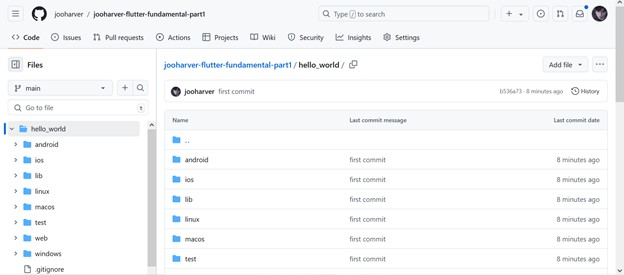
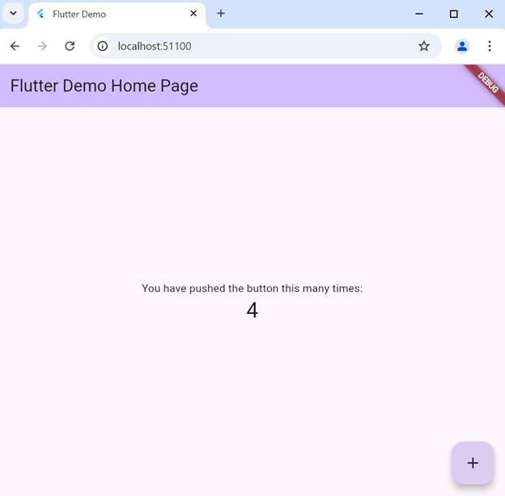
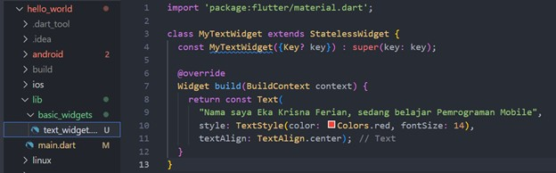
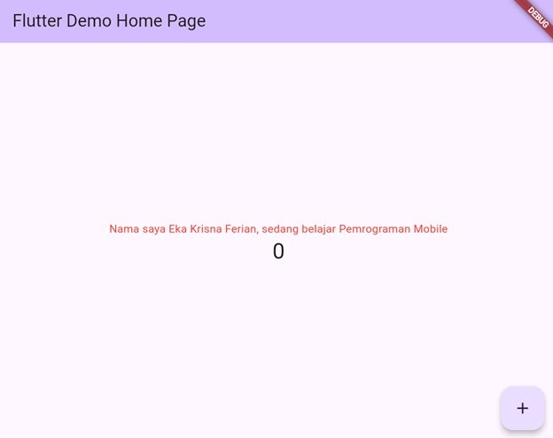

**#05 | Aplikasi Pertama dan Widget Dasar Flutter**

**Praktikum 1: Membuat Project Flutter Baru**

Langkah 1:

Buka VS Code, lalu tekan tombol Ctrl + Shift + P maka akan tampil Command Palette, lalu ketik Flutter. Pilih New Application Project.

Langkah 2:

Kemudian buat folder sesuai style laporan praktikum yang Anda pilih. Disarankan pada folder dokumen atau desktop atau alamat folder lain yang tidak terlalu dalam atau panjang. Lalu pilih Select a folder to create the project in.

Langkah 3:

Buat nama project flutter hello_world seperti berikut, lalu tekan Enter. Tunggu hingga proses pembuatan project baru selesai.

Langkah 4:

Jika sudah selesai proses pembuatan project baru, pastikan tampilan seperti berikut. Pesan akan tampil berupa "Your Flutter Project is ready!" artinya Anda telah berhasil membuat project Flutter baru.

**Praktikum 3: Membuat Repository GitHub dan Laporan Praktikum**

Langkah 1:

Login ke akun GitHub Anda, lalu buat repository baru dengan nama "flutter-fundamental-part1"

Langkah 2:

Lalu klik tombol "Create repository" lalu akan tampil seperti gambar berikut.

Setelah membuat repository, project hello_world di push ke github:

Langkah 11:

Kembali ke VS Code, ubah platform di pojok kanan bawah ke emulator atau device atau bisa juga menggunakan browser Chrome. Lalu coba running project hello_world dengan tekan F5 atau Run > Start Debugging. Tunggu proses kompilasi hingga selesai, maka aplikasi flutter pertama Anda akan tampil seperti berikut.

**Praktikum 4: Menerapkan Widget Dasar**

Langkah 1: Text Widget

Buat folder baru basic_widgets di dalam folder lib. Kemudian buat file baru di dalam basic_widgets dengan nama text_widget.dart. Ketik atau salin kode program berikut ke project hello_world Anda pada file text_widget.dart.

Langkah 2: Image Widget

Buat sebuah file image_widget.dart di dalam folder basic_widgets dengan isi kode berikut.

